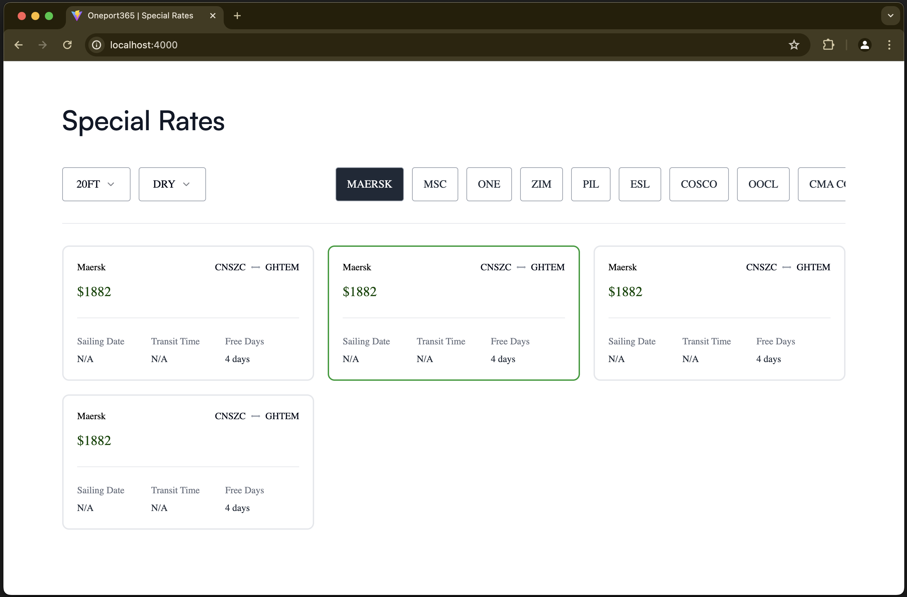

# Oneport rates UI clone

This is a clone of the [Oneport](https://www.oneport365.com/) site at the rates' scene. Showcases a list of cards:

- Special Filters: Filterable with 2 params (container size and container type) (server side)
- Rates: Filterable by rate filters (server side)

### Note

- We use `react-query` to manage API state and `Zustand` to manage UI state



### Data flow

1. We are mocking data in development with MSW library. The user will start with a selection on `containerSize` and `containerType`, any selection there will trigger a fetch of the available `specialFilters`. Initially there are 2 default ones already populated (`20FT` and `dry` respectively).
2. Then, an initial `specialFilters` will be selected by default (the first one - `Maersk`) and the `rates` will be fetched from this `specialFilters` selection, from there on other filter selection will trigger a `rates` fetch to poopulate the cards section.

- Note that we have given a delay of 500msec to all fetches to really see loaders averywhere.

## To start development server:

```
pnpm run dev
```

Next, open your browser and visit http://localhost:5173/. The default React project will be running on port 5173.

### Note:

- that if running `antfu.vite` and `antfu.browse-lite`, vite server will start itself at port 4000.

## Tests

```
pnpm test:watch

```

or

```
pnpm test:watch <path-to-file>

```

## TODOS

- [x] Add rates scene
- [x] Wire data from react-query to rates scene
- [x] Use Zustand to keep hold of filter and params UI data
- [x] Tests pass
- [x] Add documentation
- [x] Add github actions CD/CI
- [ ] Dockerize app
- [ ] ...
